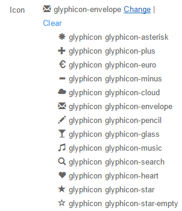

# Buttons
Configure buttons shown on the set step.  

**Title** - what the button is called. Leave empty to show icon only but an ID is required.
 
 
**Help** - optionally provides a help text for the button.
 
 
**Condition** - evaluates Boolean expressions that return true/false or 0/1 and is used to determine if the button is shown or not. Use it to show or hide buttons programatically. A common example is [HasRole:Administrators|true]. This field supports My Tokens and doesn't support InfoBox Fields.
 
 
**Style** - customizes the button's appearance depending on the chosen option:
* default
* primary
* success
* info
* warning
* danger 
* link

**Icon** - displays an icon on the button. 

 
 
**Actions** that are executed when the button is clicked.