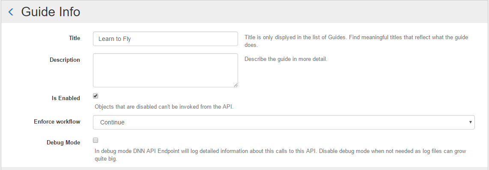
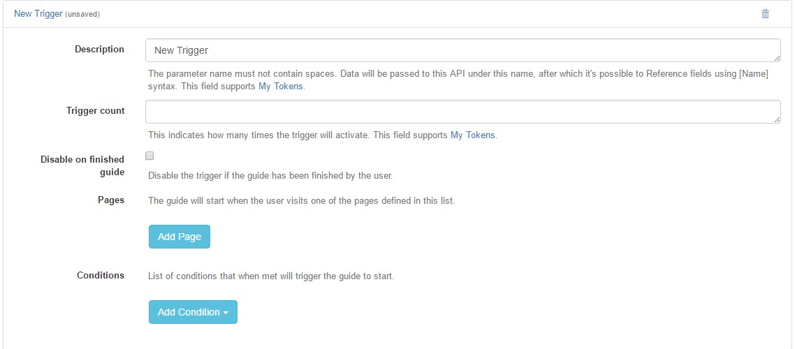
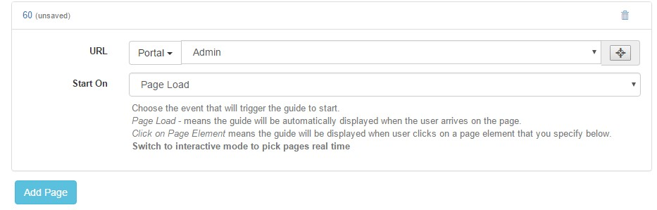
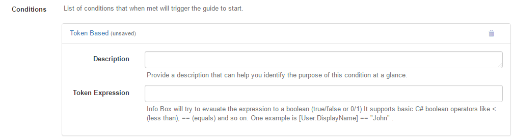
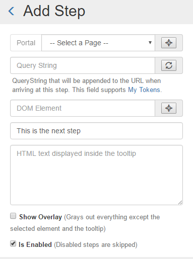
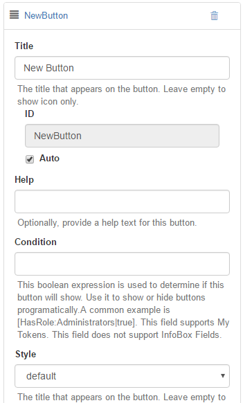
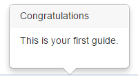

# Creating your first Guide

After the installation, it can noticed that 2 modules was created:
* **INFOBOX MODULE (avt.InfoBox)** - This is the management InfoBox Module. Note that this module is recommended to be placed only on one page, usually a page created special for Administrators to configure the module. Using this module you can manage all the things that InfoBox can provide, from creation and administration of the Guide to custom generated reports.
Once this module is placed inside a page, you can start adding your first Guide using the following step-by-step tutorial found below ;
* **INFOBOX GUIDE MENU (avt.InfoBox.GuideMenu)** - This module creates a special navigation menu, on the bottom right of the selected page(s). This menu can be used to show one or more guides. If user clicks on a guide placed in this menu, he will be redirected to the first step of the guide (if workflow is set to reset) or to continue from the last triggered step (if workflow is set to continue).

### Step-by-step Tutorial:

**Step 1 - Creating a Guide:
**In order to create a guide for the first time, you need to go to the page where the InfoBox module was created. Once there, click "New Guide". 

* Title: The title for the Guide we want to create (Will not be public) ;
* Description: A description of the Guid (Optional) (Will not be public) ;
* Is Enabled: If this box is ticked, the Guide will be enabled to public view ;
* Enforce workflow: Here we have 4 available options. For more info, see the [Info Page](http://infobox.guide.dnnsharp.com/info.html) . 

**Step 2 - Adding a trigger:
**

For more info about this step, see [Triggers Page](http://infobox.guide.dnnsharp.com/triggers.html) .

**Step 3 - Adding page(s) to the Guide:
**

For more info about this step, see [Page Menu](https://dnnsharp.gitbooks.io/info-box/content/pages.html) .

*** Step 4 - Adding Condition(s) (optional) :
**

Using conditions you can set the Guide to be displayed only to specific people.

**Step 5 - Adding Step(s):**

**Note:** We strongly recommend to create/modify the Steps using Interactive Mode, this way you can select an area from a page where the InfoBox should be displayed and all modifications made in the panel will be displayed in real time.

In order to start adding steps, you need to click on the Guide already created, and click on the "Add Step" button.

For more info about this, see [Step Menu](http://infobox.guide.dnnsharp.com/steps.html) .

**Step 6 - Adding Buttons:**

To see more info about this, see our [Buttons Page](http://infobox.guide.dnnsharp.com/buttons.html) .

**Congratulations**! Your new Guide is all set and ready to go.
