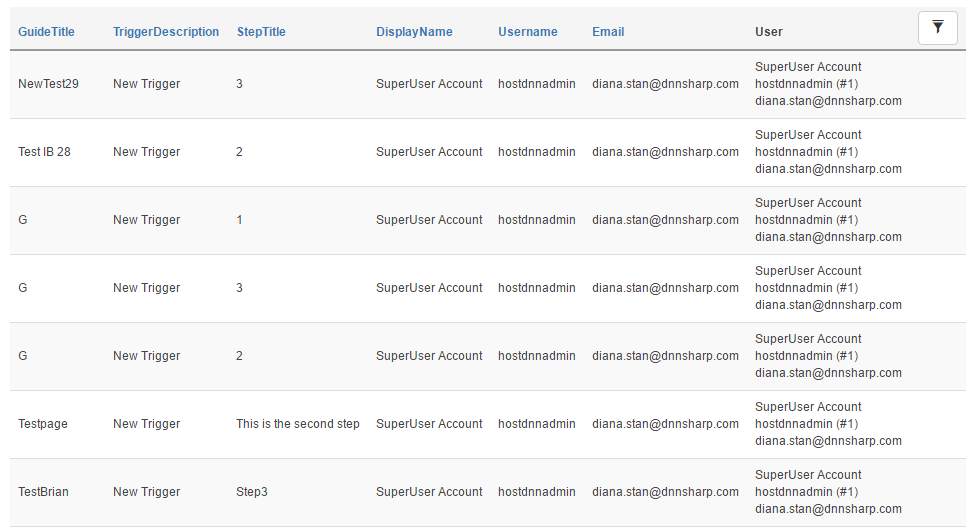


# Reports

Info Box saves information every step the user takes. These are saved in DnnSharp_InfoBox_History table. 
Optionally, grab [Action Grid](http://www.dnnsharp.com/dnn/modules/action-grid-table-data) to get access to a web based reporting UI. 
 
